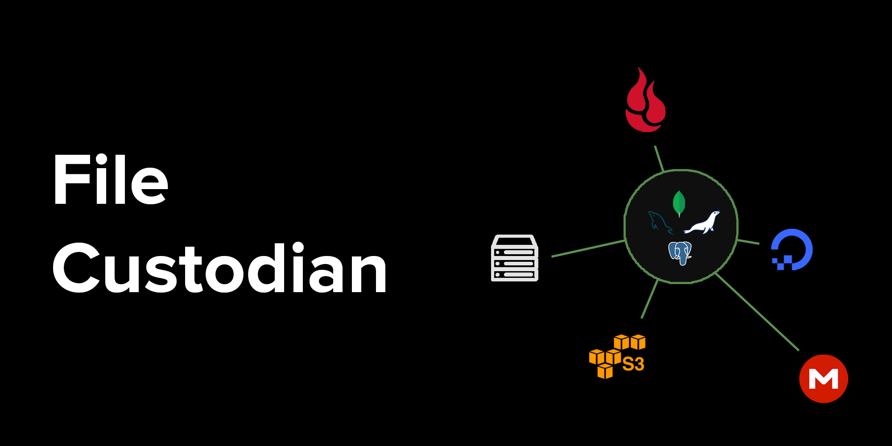

# **File Custodian**

_File custodian is a javascript library for managing files at different depositories simultaneously._



The context of this library is very simple, a depository is merely a place where files are stored. Each custodian can manage multiple depositories, each of which can have one database to record information of its files and one protector to protect them.

Install using:
```
npm i file-custodian
```

Make sure to go through the [Api Documentation](https://github.com/amirparvez/file-custodian/tree/main/docs/README.md), [Testing Documentation](https://github.com/amirparvez/file-custodian/tree/main/TESTING.md) and [Contributing Documentation](https://github.com/amirparvez/file-custodian/tree/main/CONTRIBUTING.md) to learn more.
